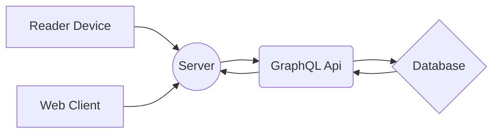

# eTicketClient by AppGrade Tech
eTicket is a platform for the management of public transport systems that allows:
- Manage Travel Payment in public transport systems
- Manage discounts to students or other agreements
- Locate the fleet of vehicles in real time
- Communicate alerts to each vehicle
- Other

eTicketClient is part of the eTicket by AppGrade Tech ecosystem: eTicketApi, eTicketReader, eTicketClient

## TODO
- [ ] Client (general)
- [ ] Client (specific)
- [ ] Reader (general)
- [ ] Api (general)
- [ ] Database Schema (general)
- [ ] Menu Workflow

## Basic Operation
General Architecture Flow:

